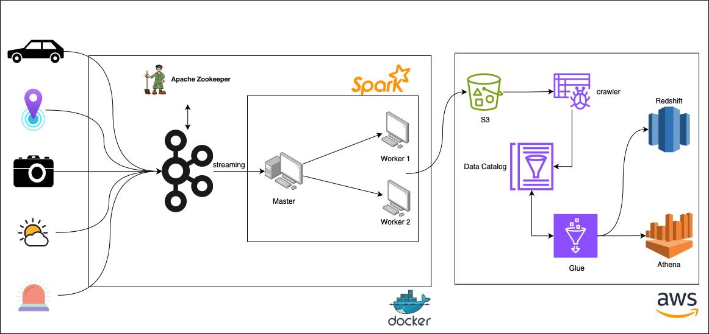

# **Smart-City-Kafka-Streaming**

## **Overview**
"Smart-City-Kafka-Streaming" is a comprehensive real-time data streaming pipeline designed to simulate and analyze vehicle data for a journey between London and Birmingham. This project incorporates various cutting-edge technologies, including IoT devices, Apache Zookeeper, Apache Kafka, Apache Spark, Docker, Python, and AWS Cloud Services (such as S3, Glue, Athena, IAM, and Redshift), to process and analyze urban data efficiently.

---

## **Architecture**
The system architecture consists of the following components:

- **IoT Devices**: Simulate the vehicle, GPS, weather, traffic, and emergency incident data.
- **Apache Zookeeper & Kafka**: Manage and stream data from IoT devices to topics.
- **Apache Spark**: Process and analyze the streamed data in real-time.
- **Docker**: Containerize the services for easy deployment and scaling.
- **AWS Services**:
  - Store processed data in **AWS S3**.
  - Catalog the data using **AWS Glue**.
  - Query the data with **AWS Athena**.
  - Load the processed data into **AWS Redshift** for further analysis.

 

---

## **Setup and Installation**

### **1. Docker**
Ensure Docker is installed on your machine. If not, download and install Docker from [Docker's official website](https://www.docker.com/).

### **2. Clone the Repository**
Clone this repository to your local machine using:
git clone https://github.com/your-username/smart-city-streaming.git

### **3. Build and Run Docker Containers**
Navigate to the project directory and run:
docker-compose up --build

### **4. Configure AWS Services**
Set up AWS S3, Glue, Athena, and Redshift with the necessary permissions and configurations.

---

## **Running the Simulation**

1. **Start Producers**: Run the IoT data producers to simulate vehicle data such as GPS location, weather conditions, traffic updates, and emergency incidents.
2. **Stream Data to Kafka**: The simulated IoT data is streamed into Kafka topics using Apache Kafka.
3. **Process Data with Spark**: Apache Spark processes and analyzes the streamed data in real-time using PySpark.
4. **Store Data in AWS S3**: The processed real-time data is stored in an AWS S3 bucket.
5. **Catalog Data with AWS Glue**: Use AWS Glue to catalog the stored S3 data for easier querying.
6. **Query Data with AWS Athena**: Analyze the cataloged data using SQL queries in AWS Athena.
7. **Load Data into AWS Redshift**: Transfer processed data into Amazon Redshift for further analysis.

---

## **Acknowledgements**
Special thanks to Yusuf Ganiyu for his comprehensive video tutorial that guided the development of this project.

